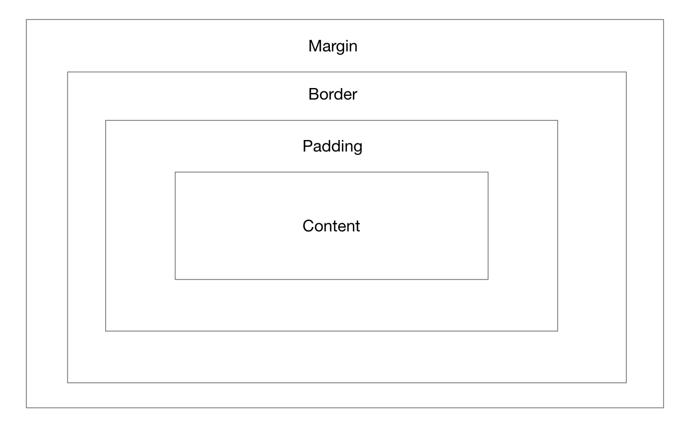
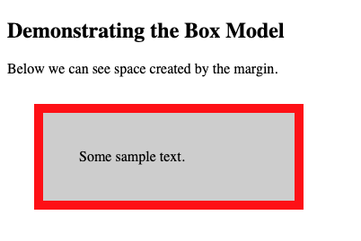

## Questions and Answers

### 1. Explain using code examples, what is meant by props and state in React JS.

Props are used to pass data between components. This is uni-directional and data can only be passed from a parent to a child component. The word props is short for properties. An example of how props can be used is available below.

```JavaScript
function WelcomeUser(props) {
  return <h1>Hello, {props.name}</h1>;
}

const root = ReactDOM.createRoot(document.getElementById('root'));
const element = <WelcomeUser name="Ben" />;
root.render(element);

```

States are where the property values that belong to a component are stored. When the state of an object is changed, the component is rendered again. An example of states can be seen in the code below.

```JavaScript
Class MyClass extends React.Component
{
    constructor(props)
    {
        super(props);
        this.state = { attribute : "value" };
    }
}
```

The state can then be modified with:

```JavaScript
this.state.attribute = "new-value";
```

### 2. In functional programming what does the word functor mean? Can you give an example in JavaScript?

A functor is a data object that is able to hold elements that are of any data type and can be mapped over by implementing the map operation. A functors map function uses another function as an argument and this function is called on each element within the functor. The end result is a new functor with the same number of elements in it as the original functor.

```JavaScript
const prime = [1,3,9,11,13];
	.map(p => parseInt(p))
	.map(p => p * 2) => [2,6,18,22,26]
```

### 3. We have looked at three kinds of asynchronous programming mechanisms, namely callbacks, promises and streams. Mention one advantage and one disadvantage of each type.

##### Advantage of callbacks:

Callbacks make it easier to call one function from another and also allow for one function to be completed before the other is executed.

##### Disadvantage of callbacks:

The callback hell problem is a problem that occurs when callbacks are nested among each other, and each callback is dependent on the one before it. This can affect code readability and make code very messy.

##### Advantage of promises:

Promises are easy to read and can improve code readability.

##### Disadvantage of promises:

They are slower than callbacks, this may causer performance issues.

##### Advantage of streams:

Streams can process as they go. Operations can be performed on the data when the stream is still being processed so long as the data being looked for is there.

##### Disadvantage of streams:

Data consistency is a potential disadvantage to using streams in JavaScript.

### 4. With the aid of a diagram and example code, describe the CSS Box Model and show how it can be used to space DOM elements.

The CSS Box Model can be thought of as a box that is wrapped around every HTML element. From the inside out, the box model consists of content, padding, border and margin. The diagram below gives a visual representation of the CSS box model.


The content is where the content of the element goes.
The padding creates space around the content, this is transparrent.
The border goes around the content and padding.
The margin creates space outside the border. The margin like the padding is also transparent.

Some sample code and the result:

```CSS
div {
  background-color: lightgrey;
  width: 200px;
  border: 10px solid red;
  padding: 40px;
  margin: 30px;
}
```


